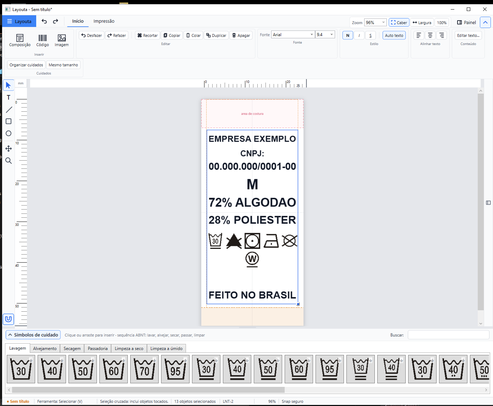

  

<h1 align="center">Layouta</h1>

  Etiquetas certas, sem brigar com a impressora.

  <a href="../../releases/latest"><strong>Baixar para Windows</strong></a>
  &nbsp;&middot;&nbsp;
  <a href="https://treeks12.github.io/layouta-releases/">Conhecer o Layouta</a>

  
  
  

## Feito para o trabalho real

O Layouta cria, revisa e imprime etiquetas de composição têxtil com medidas
reais. Ele preserva o fluxo conhecido por quem usou MasterPrint por anos, mas
acrescenta alinhamento inteligente, desfazer, revisão têxtil e uma prévia de
impressão que corresponde à folha.

- **Compatibilidade:** abre arquivos `.ETQ` legados e salva no formato `.layouta`.
- **Precisão:** formatos LNT, repetição em folha A4 e calibração por impressora.
- **Edição confortável:** seleção múltipla, snap, distribuição, tamanho igual e texto automático.
- **Cuidados têxteis:** catálogo visual organizado pela sequência ABNT e revisão antes de imprimir.
- **Instalação simples:** um único instalador, sem exigir o .NET na máquina.

## Instalação

1. Baixe o [`LayoutaSetup.exe`](../../releases/latest/download/LayoutaSetup.exe).
2. Execute o instalador.
3. Crie ou entre em uma conta gratuita para abrir o editor.

O Layouta está em beta. A impressão foi calibrada com folhas reais, mas cada
combinação de impressora e material pode exigir um pequeno ajuste no assistente
de calibração.

> O código-fonte e os arquivos internos de desenvolvimento permanecem privados.
> Este repositório distribui somente o instalador oficial e seu manifesto de atualização.
